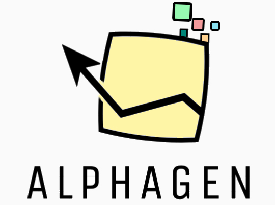
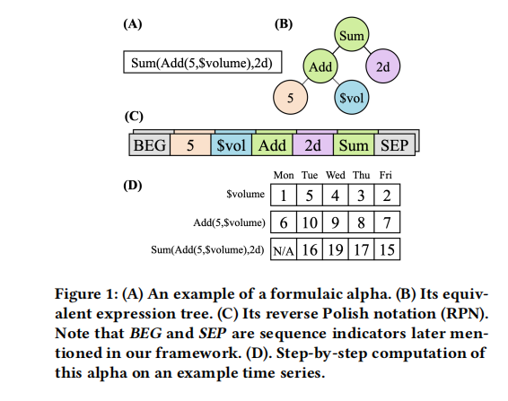
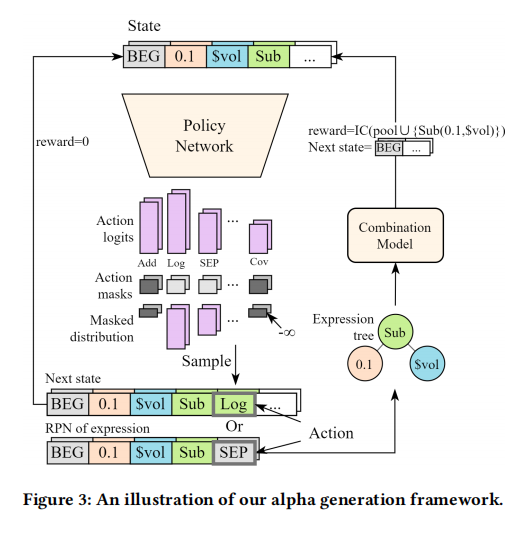
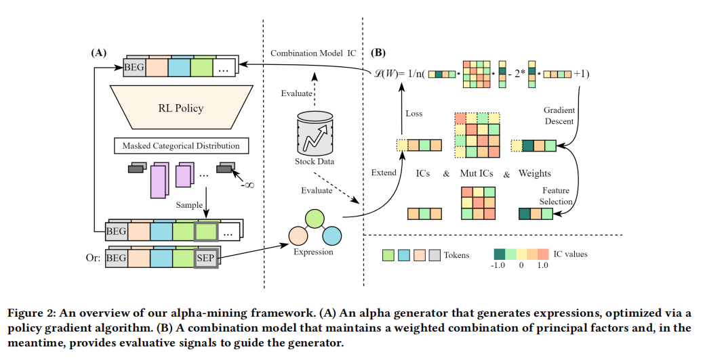
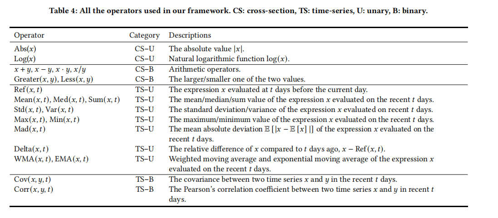

# AlphaGen

<p align="center">
    
</p>

<font color=#FFOOOO size=4>This is a revised code for windows and cpu environment.</font>

Automatic formulaic alpha generation with reinforcement learning.

Paper *Generating Synergistic Formulaic Alpha Collections via Reinforcement Learning* accepted by [KDD 2023](https://kdd.org/kdd2023/), Applied Data Science (ADS) track.

Paper available on [ACM DL](https://dl.acm.org/doi/10.1145/3580305.3599831) or [arXiv](https://arxiv.org/abs/2306.12964).

## Framework

<p align="center">
    
</p>

生成逆波兰表达式（RPN），使用T特征提取器处理成数字矩阵。指定特征提取器的类为 `LSTMSharedNet`

`LSTMSharedNet` 类通过结合嵌入层和位置编码，将离散的动作ID转换为连续的特征向量，并通过LSTM网络处理这些向量以捕获时间序列中的动态特征。这些特征随后可以被强化学习模型用来做出决策。

价值网络和策略网络共享一个基础的特征提取器(features_extractor)。

<p align="center">
    
</p>

1. 定义状态（State），包括当前已经部分生成的序列和其他相关信息（例如历史数据等）。 
2. 定义行动（Action），即将要添加到序列尾部的下一个Token。 
3. 定义状态转移（Dynamic），即将行动对应的Token添加到状态的末尾，得到新的状态。 
4. 定义奖励（Reward），即序列仅在结束时有非0的奖励，将序列转换为因子即为结束状态。合法因子的奖励为集成模型更新后的IC（信息系数），非法因子的奖励为-1。 
5. 定义动作掩蔽（Action Mask），为了保证因子的形式有效性，我们能够根据状态判断一个动作是否合法，不合法的动作将被掩蔽。 
6. 使用动作掩码PPO算法来训练因子的生成器。在每个时间步，根据当前状态选择一个行动，并生成新的状态和奖励。根据这些信息，更新生成器的策略，使其能够更好地生成合法的逆波兰表达式，从而获得更高的奖励。 

<p align="center">
    
</p>

一个利用强化学习来改善搜索空间的探索，并使用带有约束条件的序列生成器和基于策略梯度算法来生成有效的公式alpha因子的框架。整个算法分为两部分：因子生成和因子评估，两部分交替运行。

<p align="center">
    
</p>

Here shows the operators.

## Other environment conditions

- OS: Windows-10-10.0.22631-SP0 10.0.22631
- Python: 3.8.19
- Stable-Baselines3: 2.0.0
- PyTorch: 2.0.1+cpu
- GPU Enabled: False
- Numpy: 1.23.5
- Cloudpickle: 2.2.1
- Gymnasium: 0.28.1
- OpenAI Gym: 0.26.2

In requirements.txt:
- baostock, this must be the latest version, or it won't work
- gym==0.26.2
- matplotlib==3.3.4
- numpy==1.23.5
- pandas==1.2.4
- qlib==0.0.2.dev20
- sb3_contrib==2.0.0, has extentions to stable_baselines3
- stable_baselines3==2.0.0, for RL
- torch==2.0.1
- shimmy==1.1.0
- fire, for cmd
- tqdm
- loguru, a logger package
- requests
- pyqlib
- pandera == 0.20.3, for trade and backtest

## Folders

code：../alphagen

data：../.qlib

result：../path

## Run process

### install environment
```bash
conda create -n alphagen python==3.8
conda activate alphagen

pip install -r alphagen/requirements.txt
```

### Get the data
See it in [Qlib](https://github.com/microsoft/qlib#data-preparation), wget is often used in Linux.
```bash
wget https://github.com/chenditc/investment_data/releases/download/20220720/qlib_bin.tar.gz
mkdir -p /.qlib/qlib_data/cn_data
tar -zxvf qlib_bin.tar.gz -C /.qlib/qlib_data/cn_data --strip-components=2
```
New code for windows and new data
Nb! The structure of qlib_bin.tar.gz has changed!
```bash
wget https://github.com/chenditc/investment_data/releases/download/2024-07-31/qlib_bin.tar.gz
mkdir ~/.qlib/qlib_data/cn_data
tar -zxvf qlib_bin.tar.gz -C ~/.qlib/qlib_data/cn_data --strip-components=2--strip-components=2
```
The next code block could not be run.
```bash
rm -f qlib_bin.tar.gz
```
```bash
python alphagen/data_collection/fetch_baostock_data.py
```

### Run and learn
```bash
python alphagen/train_maskable_ppo.py --seed=1 --pool=10 --code="csi300" --step=200000
```

# Old README txt

## How to reproduce?

Note that you can either use our builtin alpha calculation pipeline(see Choice 1), or implement an adapter to your own pipeline(see Choice 2).

### Choice 1: Stock data preparation

Builtin pipeline requires Qlib library and local-storaged stock data.

- READ THIS! We need some of the metadata (but not the actual stock price/volume data) given by Qlib, so follow the data preparing process in [Qlib](https://github.com/microsoft/qlib#data-preparation) first.
- The actual stock data we use are retrieved from [baostock](http://baostock.com/baostock/index.php/%E9%A6%96%E9%A1%B5), due to concerns on the timeliness and truthfulness of the data source used by Qlib.
- The data can be downloaded by running the script `data_collection/fetch_baostock_data.py`. The newly downloaded data is saved into `~/.qlib/qlib_data/cn_data_baostock_fwdadj` by default. This path can be customized to fit your specific needs, but make sure to use the correct path when loading the data (In `alphagen_qlib/stock_data.py`, function `StockData._init_qlib`, the path should be passed to qlib with `qlib.init(provider_uri=path)`).

### Choice 2: Adapt to external pipelines

Maybe you have better implements of alpha calculation, you can implement an adapter of `alphagen.data.calculator.AlphaCalculator`. The interface is defined as follows:

```python
class AlphaCalculator(metaclass=ABCMeta):
    @abstractmethod
    def calc_single_IC_ret(self, expr: Expression) -> float:
        'Calculate IC between a single alpha and a predefined target.'

    @abstractmethod
    def calc_single_rIC_ret(self, expr: Expression) -> float:
        'Calculate Rank IC between a single alpha and a predefined target.'

    @abstractmethod
    def calc_single_all_ret(self, expr: Expression) -> Tuple[float, float]:
        'Calculate both IC and Rank IC between a single alpha and a predefined target.'

    @abstractmethod
    def calc_mutual_IC(self, expr1: Expression, expr2: Expression) -> float:
        'Calculate IC between two alphas.'

    @abstractmethod
    def calc_pool_IC_ret(self, exprs: List[Expression], weights: List[float]) -> float:
        'First combine the alphas linearly,'
        'then Calculate IC between the linear combination and a predefined target.'

    @abstractmethod
    def calc_pool_rIC_ret(self, exprs: List[Expression], weights: List[float]) -> float:
        'First combine the alphas linearly,'
        'then Calculate Rank IC between the linear combination and a predefined target.'

    @abstractmethod
    def calc_pool_all_ret(self, exprs: List[Expression], weights: List[float]) -> Tuple[float, float]:
        'First combine the alphas linearly,'
        'then Calculate both IC and Rank IC between the linear combination and a predefined target.'
```

Reminder: the values evaluated from different alphas may have drastically different scales, we recommend that you should normalize them before combination.

### Before running

All principle components of our expriment are located in [train_maskable_ppo.py](train_maskable_ppo.py).

These parameters may help you build an `AlphaCalculator`:

- instruments (Set of instruments)
- start_time & end_time (Data range for each dataset)
- target (Target stock trend, e.g., 20d return rate)

These parameters will define a RL run:

- batch_size (PPO batch size)
- features_extractor_kwargs (Arguments for LSTM shared net)
- device (PyTorch device)
- save_path (Path for checkpoints)
- tensorboard_log (Path for TensorBoard)

### Run!

```shell
python train_maskable_ppo.py --seed=SEED --pool=POOL_CAPACITY --code=INSTRUMENTS --step=NUM_STEPS
```

Where `SEED` is random seed, e.g., `1` or `1,2`, `POOL_CAPACITY` is the size of combination model and, `NUM_STEPS` is the limit of RL steps.

### After running

- Model checkpoints and alpha pools are located in `save_path`;
    - The model is compatiable with [stable-baselines3](https://github.com/DLR-RM/stable-baselines3)
    - Alpha pools are formatted in human-readable JSON.
- Tensorboard logs are located in `tensorboard_log`.

## Baselines

### GP-based methods

[gplearn](https://github.com/trevorstephens/gplearn) implements Genetic Programming, a commonly used method for symbolic regression. We maintained a modified version of gplearn to make it compatiable with our task. The corresponding experiment scipt is [gp.py](gp.py)

### Deep Symbolic Regression

[DSO](https://github.com/brendenpetersen/deep-symbolic-optimization) is a mature deep learning framework for symbolic optimization tasks. We maintained a minimal version of DSO to make it compatiable with our task. The corresponding experiment scipt is [dso.py](dso.py)

## Repository Structure

- `/alphagen` contains the basic data structures and the essential modules for starting an alpha mining pipeline;
- `/alphagen_qlib` contains the qlib-specific APIs for data preparation;
- `/alphagen_generic` contains data structures and utils designed for our baselines, which basically follow [gplearn](https://github.com/trevorstephens/gplearn) APIs, but with modifications for quant pipeline;
- `/gplearn` and `/dso` contains modified versions of our baselines.

## Trading (Experimental)

We implemented some trading strategies based on Qlib. See [backtest.py](backtest.py) and [trade_decision.py](trade_decision.py) for demos.

## Citing our work

```bibtex
@inproceedings{alphagen,
    author = {Yu, Shuo and Xue, Hongyan and Ao, Xiang and Pan, Feiyang and He, Jia and Tu, Dandan and He, Qing},
    title = {Generating Synergistic Formulaic Alpha Collections via Reinforcement Learning},
    year = {2023},
    doi = {10.1145/3580305.3599831},
    booktitle = {Proceedings of the 29th ACM SIGKDD Conference on Knowledge Discovery and Data Mining},
}
```

## Contributing

Feel free to submit Issues or Pull requests.

## Contributors

This work is maintained by the MLDM research group, [IIP, ICT, CAS](http://iip.ict.ac.cn/).

Maintainers include:

- [Hongyan Xue](https://github.com/xuehongyanL)
- [Shuo Yu](https://github.com/Chlorie)

Thanks to the following contributors:

- [@yigaza](https://github.com/yigaza)

Thanks to the following in-depth research on our project:

- *因子选股系列之九十五:DFQ强化学习因子组合挖掘系统*
